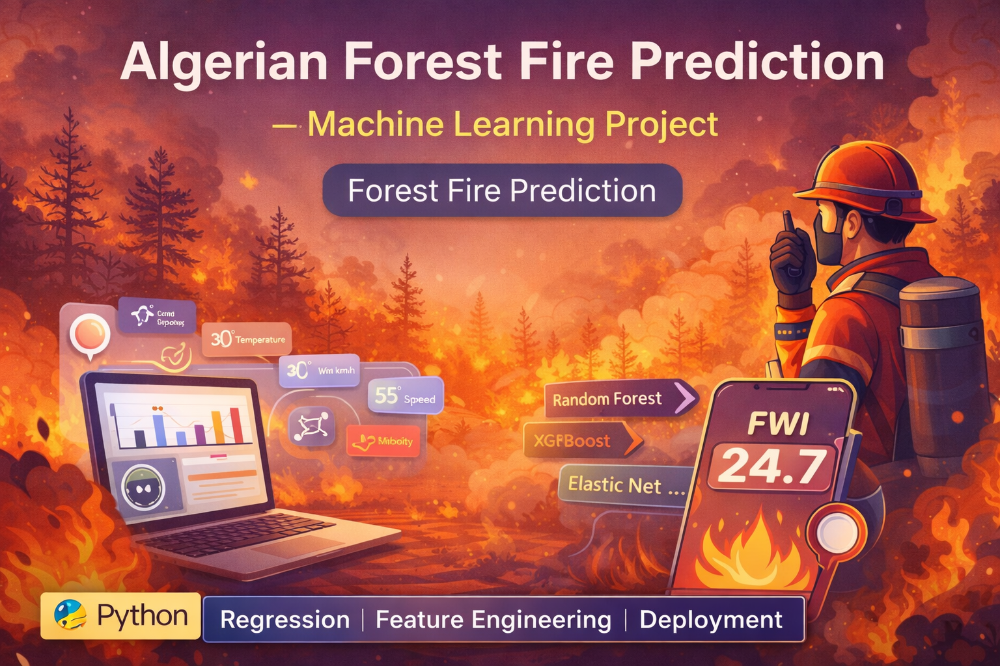

# 🔥 Algerian Forest Fire Prediction — Machine Learning Project  

---

  

---

A **Machine Learning project** that predicts the **Fire Weather Index (FWI)** for the **Algerian Forest Fires Dataset** using environmental features such as temperature, humidity, wind, and rainfall.  
This project demonstrates a complete **end-to-end ML pipeline**, including preprocessing, feature engineering, regression model training, hyperparameter tuning, and deployment using **Python** and **Scikit-learn**.

---

## 📁 Project Overview

The **Algerian Forest Fire Dataset** contains meteorological and fire danger indices collected from two regions:  
- **Bejaia Region (North Algeria)**  
- **Sidi Bel-Abbes Region (Northwest Algeria)**  

The goal is to build a regression model that predicts the **Fire Weather Index (FWI)**, representing fire intensity and spread potential.

### Dataset Features:
- Temperature (°C)  
- Relative Humidity (%)  
- Wind Speed (km/h)  
- Rain (mm)  
- FFMC (Fine Fuel Moisture Code)  
- DMC (Duff Moisture Code)  
- DC (Drought Code)  
- ISI (Initial Spread Index)  
- Region Index (0 = Bejaia, 1 = Sidi Bel-Abbes)  
- **FWI (Target Variable)**

---

## 🎯 Project Objectives

1. Clean and preprocess dataset  
2. Fix missing values & outliers  
3. Encode categorical features  
4. Scale features for model consistency  
5. Train multiple regression models:  
   - **Linear Regression**  
   - **Ridge Regression**  
   - **Lasso Regression**  
   - **Elastic Net**   
6. Compare model performance  
7. Hyperparameter tuning using GridSearchCV  
8. Save the best model using **Pickle**  
9. Deploy using **Streamlit**  

---

## ⚙️ Tech Stack

| Component | Description |
|----------|-------------|
| **Language** | Python |
| **Libraries** | Pandas, NumPy, Scikit-learn, Matplotlib, Seaborn |
| **Models** | Linear, Ridge, Lasso, Elastic Net |
| **Deployment** | Streamlit |
| **IDE** | Jupyter Notebook ,VS Code|

---

## 🧠 Machine Learning Concepts Used

- Data Cleaning  
- One-Hot Encoding  
- Standardization (Scaling)  
- Linear & Regularized Regression Models  
- Ensemble Regression  
- Hyperparameter Tuning  
- Evaluation Metrics (RMSE, MAE, R²)  
- Pickle Model Saving  
- Streamlit UI Integration  

---

## 📊 Model Evaluation Metrics

| Metric | Description |
|--------|-------------|
| **R² Score** | Measures goodness of fit |
| **MAE** | Average prediction error |
| **MSE / RMSE** | Penalizes large errors |

-

---

## 🧾 Conclusion

This **Algerian Forest Fire Prediction System** uses multiple regression models—including **Ridge, Lasso, Elastic Net, Random Forest, and XGBoost**—to accurately estimate the Fire Weather Index.  
Through strong preprocessing, feature engineering, and model comparison, this project demonstrates how ML can help in **forest management, early fire risk detection, and disaster prevention**.

### 🔮 Future Scope
- Integrate deep learning models  
- Display real-time weather-based predictions  
- Build an interactive Streamlit dashboard  
- Deploy on cloud (AWS / GCP / Azure)  

This project highlights the power of **AI-driven prediction systems** for environmental safety and decision-making.

---
